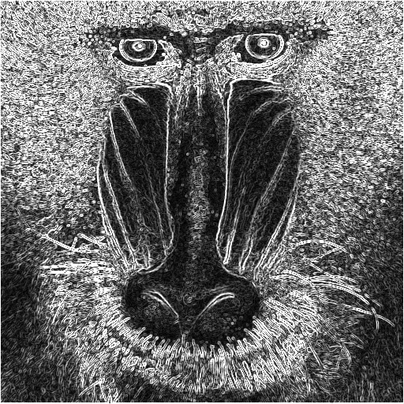
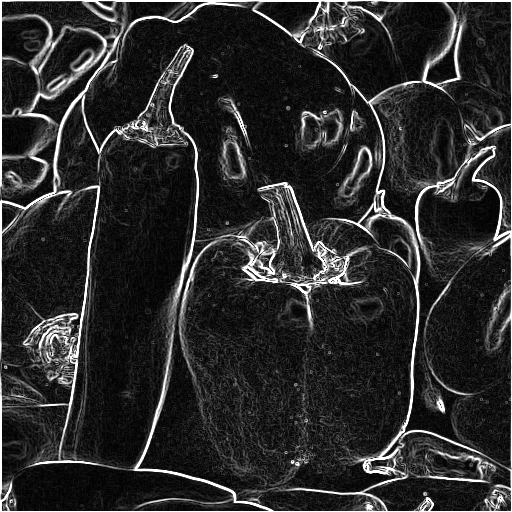

# <center>Edge Detection</center>

資工四 408410098 蔡嘉祥

- date due : 6/14
- date handed in : 6/16
<div style="break-after: page; page-break-after: always;"></div>

## <center>Technical description</center>

使用語言 : Python
- third-party packages :
  - numpy 
  - opencv (cv2)
如何執行: 
- 下命令 : ```python edgedetection.py``` 即可

執行的結果會在 ```./edge_detection1/``` 資料夾底下。

### 做法
使用 $x$ 與 $y$ 兩個方向的 Sobel operators:

$$m_x:\begin{bmatrix}
1 & 0 & -1 \\
2 & 0 & -2 \\
1 & 0 & -1
\end{bmatrix}, m_y:\begin{bmatrix}
1 & 2 & 1 \\
0 & 0 & 0 \\
-1 & -2 & -1
\end{bmatrix}$$

把上述兩個 mask 跟轉成 grayscale 的圖片分別進行 Convlution 後, 取他們的幾何平均。

$G_x = m_x \* IMG, G_y = m_y \* IMG$ 

(* means convolution)

$E = \sqrt{G_x^2+G_y^2}$

最後 shift 到 0~255 輸出。

<div style="break-after: page; page-break-after: always;"></div>

## <center>Experimental results & Disccussions</center>

本報告結果附在 ```./edge_detection/``` 裡面

### baboon:
(origin) (edge)

### peppers
(origin) (edge) 

### pool
(origin)  (edge)

## <center>Reference</center>

- RGB to Gray scale : https://www.baeldung.com/cs/convert-rgb-to-grayscale
- Sobel operator : CH10 投影片