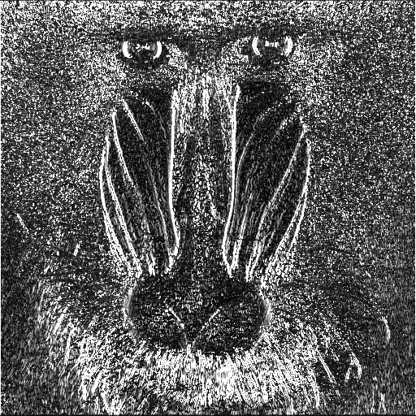
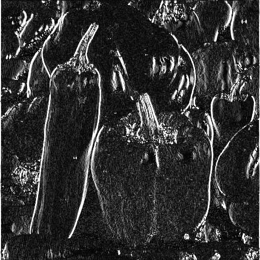

# <center>Edge Detection</center>

資工四 408410098 蔡嘉祥

- date due : 6/16
- date handed in : 6/14
<div style="break-after: page; page-break-after: always;"></div>

## <center>Technical description</center>

使用語言 : Python
- third-party packages :
  - numpy 
  - opencv (cv2)
如何執行: 
- 下命令 : ```python edgedetection.py``` 即可

執行的結果會在 ```./result/``` 資料夾底下。

### 做法
使用 $x$ 與 $y$ 兩個方向的 Sobel operators:

$$m_x:\begin{bmatrix}
1 & 0 & -1 \\
2 & 0 & -2 \\
1 & 0 & -1
\end{bmatrix}, m_y:\begin{bmatrix}
1 & 2 & 1 \\
0 & 0 & 0 \\
-1 & -2 & -1
\end{bmatrix}$$

$g_x = m_x \ast IMG, g_y = m_y \ast IMG$ (* means convolution)

$$g_{xx} = \frac{\partial{R}}{\partial{x}}^2+\frac{\partial{G}}{\partial{x}}^2+\frac{\partial{B}}{\partial{x}}^2=\displaystyle\sum_{c=R,G,B}g_{x,c}^2$$

$$g_{yy} = \frac{\partial{R}}{\partial{y}}^2+\frac{\partial{G}}{\partial{y}}^2+\frac{\partial{B}}{\partial{y}}^2=\displaystyle\sum_{c=R,G,B}g_{y,c}^2$$

$$g_{xy} = \frac{\partial{R}}{\partial{x}}\frac{\partial{R}}{\partial{y}}+\frac{\partial{G}}{\partial{x}}\frac{\partial{G}}{\partial{y}}+\frac{\partial{B}}{\partial{x}}\frac{\partial{B}}{\partial{y}}=\displaystyle\sum_{c=R,G,B}\text{elemul}(g_{x,c},g_{y,c})
$$ 

direction : $\theta = \frac{1}{2}\tan^{-1}(\frac{2g_{xy}}{g_{xx}-g_{yy}})$ ，這邊為了不要讓分母有 0 出現，我將分母額外加了一個 $\epsilon = 10^{-10}$

$F=[\frac{1}{2}((g_{xx}+g_{yy}) + \cos(2\theta)(g_{xx}-g_{yy}) + 2g_{xy}\sin(2\theta))]^{\frac{1}{2}}$ ，這裡我有將F 小於 0 的值把他視為 0 以開根號。

最後 shift $F$ 到 0~255 輸出。

<div style="break-after: page; page-break-after: always;"></div>

## <center>Experimental results & Disccussions</center>

本報告結果附在 ```./result/``` 裡面

### baboon:
(origin) (edge)

### peppers
(origin) (edge) 

### pool
(origin)  (edge)

## <center>Reference</center>

- CH06 p.71-p.72
- Sobel operator : CH10 投影片