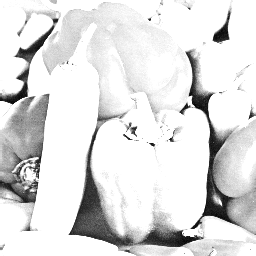

# <center>Histogram Equalization</center>

資工四 408410098 蔡嘉祥

- date due : 4/17 
- date handed in : 4/10

<div style="break-after: page; page-break-after: always;"></div>

## <center>Technical description</center>

- 使用語言 : python 
  - 所需要的第三方套件: 
    - numpy 
    - opencv-python
    - tqdm 
    - matplotlib
  
  - 如何執行 : 下命令: ```python historgramEQ.py```

執行完後，會在工作目錄下產生 ```result1/``` 的目錄，執行後的結果會寫在裡面。

### 實作 histogram equalization
- 圖片 IO:
    
  - input : 使用 ```opencv (cv2)``` cv2.imread()來讀取 .bmp 圖片成 ```numpy``` array (shape : 256 x 256, gray level)
  
  - output : 使用 cv2.imwrite() 來將 numpy array 寫成 .bmp。

- 取得histogram: 
    
    使用 ```np.bincount(img.flatten(), minlenght=256)``` 來得到 histogram。 

- Transform:
   
   有了histogram 之後，使用  ```np.cumsum(historgram/img.size)``` 將 $s_k,k=0,1,...,255$ 算出來。

   最後，將各 $s_k*255$ 並轉成 unsigned 8-bit int，作為 ```transform```，把原始圖片各pixel 的值換成對應的 ```transform``` 的值，即完成 global histogram equlization 。

- local histogram equlization:
    
    每個block 為 64 x 64，16 個等大的 blocks，分別把每個 block 當作一張 subimage，並分別對每張 subimage 進行 global histogram equlization。

<div style="break-after: page; page-break-after: always;"></div>

## <center>Experimental results</center>

所有的 histogram 都有放在 ```result/*hist/hist.json``` 裡面，為一個JSON 格式檔案: global 的話，會有兩個 list，分別是 origin 以及 transform 的 0~ 255 每個 pixel 的數量； local 的話則是每個 block 都有。

### Lena:

(o)
(g)
(l)

(o)origin  (g)global histogram equalization (l)local histogram equalization(16 blocks)

原始與轉換後的 pixels 的histogram (global):


原始與轉換後的 pixels 的histogram (local):


原始與轉換後的 pixels 的histogram (local) (each block):


<div style="break-after: page; page-break-after: always;"></div>

### Peppers:

(o)
(g)
(l)

(o)origin  (g)global histogram equalization (l)local histogram equalization(16 blocks)

原始與轉換後的 pixels 的histogram:


原始與轉換後的 pixels 的histogram (local):


原始與轉換後的 pixels 的histogram (local) (each block):


<div style="break-after: page; page-break-after: always;"></div>

## <center>Discussions</center>

1. 從統計的直方圖中可以看出，相較於原本的 pixel 值的分布情況，經過 histogram equalization 後，會比較分散一些，不會過於集中在某個小區域，藉以提高圖片的對比率，提升視覺效果。

2. 在針對 Peppers.bmp 這張圖的時候，從計數直方圖可以發現，該圖片較大 (較亮) 的pixel 值居多，使用histogram equalization 之後，由於原本較小值的pixels 的cumulative 較少，轉換後就更小 (暗)，使暗者更暗，因而更能加強其亮暗之間的對比程度拉大。從轉換後的圖片也可以看出這點。
   
3. 在針對 Lena.bmp 這張圖的時候，從計數直方圖可以發現，該圖片較小 (較暗) 的pixel 值居多，所以會造成使用 histogram equlization 之後，最暗的 pixel 值都有 101，使整張圖偏亮。我想這也應該是這個方法的其中一個限制。

4. 對於local 的做法，我發現如果使用這種作法，好像會產生邊框效應，視覺上容易察覺一塊一塊的。或許可以縮小block size，或是使用像是 neighborhood 滑動的方式，一次只改一個 height 或 width 的值當成一個block，然後把該位置的值取每次有對其做到 local histogram equalization 的值平均，藉以消除邊框效應。
   
## <center>Reference</center> 

- 投影片 Ch03