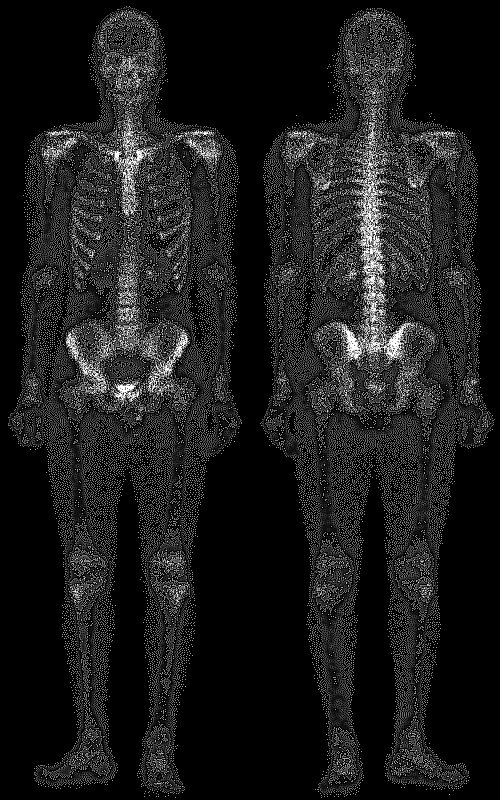
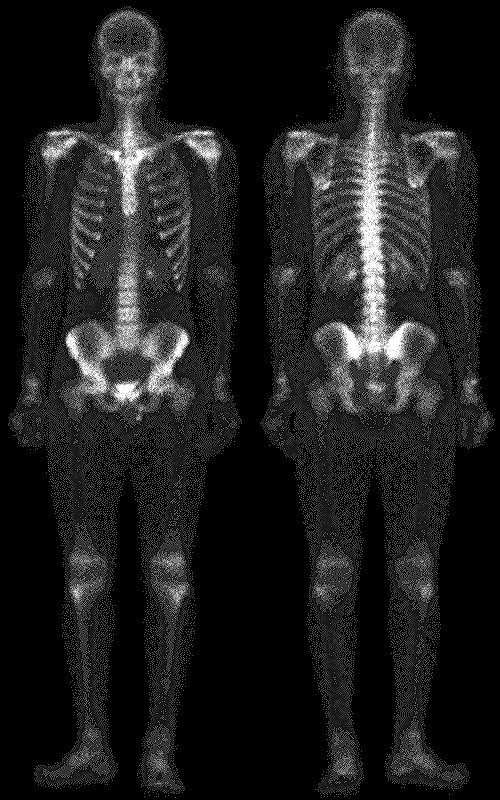
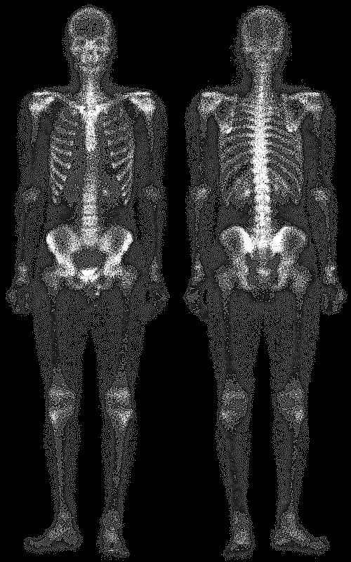
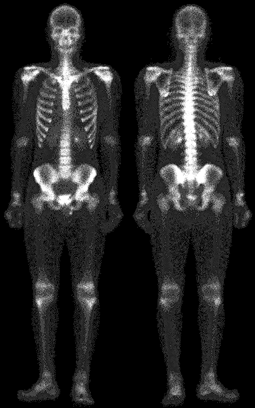

# <center>Sharpening</center>

資工四 408410098 蔡嘉祥

- date due : 5/7 
- date handed in : 5/9

<div style="break-after: page; page-break-after: always;"></div>

# <center>Technical description</center>

### 如何執行
下命令 : ```python imgsharpening.py``` 即可
- 所需要的第三方套件:
  - numpy 
  - opencv (cv2)
  
結果會存在 ```./result1/``` 裡面，有使用 mask center = -4, -8 以及 A = 1.0, 1.5, 1.7, 2.0 的結果

### 演算法說明
- 2D Convolution:
  實作於 function ```Conv2D(img, mask)```。 
  
  首先我先將圖片外圍一圈做 zero padding( ```Conv2D().padding()``` )。


  直接使用兩個 for-loop 效能太低，為了提升速度，我將 mask 要運作的每個 blocks 先建構出來，為一個 
  
  $/text{Blocks, size} = (M+1)/times (N+1) /times [3 /times 3]$

  之後就直接把 Blocks*mask (對應元素相乘)，再取 .sum(aixs = (2,3))，把每個block內與 mask 對應相乘後的結果相加，來實現 2D Convolution。

- mask:
  - $/text{Laplacian Operator}$:

$$/begin{bmatrix}
    0 & -1 & 0 //
    -1 & -4 & -1 //
    0 & -1 & 0 //
/end{bmatrix}  /begin{bmatrix}
    -1 & -1 & -1 //
    -1 & -8 & -1 //
    -1 & -1 & -1 //
/end{bmatrix}$$

- Sharpening
$$f_{hb}(x,y) = Af(x,y)-/text{Laplacian}*f(x,y)$$

化簡後，即為:

$$ f_{hb} = /begin{bmatrix}
    0 & -1 & 0 //
    -1 & A+4 & -1 //
    0 & -1 & 0 //
/end{bmatrix} * f(x,y)$$

$$ f_{hb} =  /begin{bmatrix}
    -1 & -1 & -1 //
    -1 & A+8 & -1 //
    -1 & -1 & -1 //
/end{bmatrix} * f(x,y)$$

我的程式碼即是依照化簡後的公式撰寫。 ( ```IMGSharpler.Laplacian_Sharpening()``` )

<div style="break-after: page; page-break-after: always;"></div>

# <center>Experimental results</center>

## Standard Laplacian Operator 
我直接使用 A = 1:

- __Blurry moon__ :
  
    (c = -4) 
    (c = -8) 

- __skeleton_orig__ :
    
    (c = -4)  
    (c = -8) 

## High boosted filtering 
使用 $A /geq 1$:

- 1 , 1.5, 1.7, 2

### A = 1.5

- __blurry_moon__ :

(c = -4) (c = -8)

- __skeleton_moon__ :

(c = -4)  (c = -8)

### A = 1.7

- __blurry_moon__ :

(c = -4) (c = -8)

- __skeleton_moon__ :

(c = -4)  (c = -8)


#### A = 2

- __blurry_moon__ :

(c = -4) (c = -8)

- __skeleton_moon__ :

(c = -4)  (c = -8)


<div style="break-after: page; page-break-after: always;"></div>

## <center>Discussions</center>

- Mask center:
  從比對中發現，使用 center = -8 的 mask 做出來的結果細部輪廓更明顯。

- A:
  A 越大，整張圖片亮的部分會變更亮。

## <center>Reference</center> 
Ch03 投影片

Convolution code : https://gist.github.com/ThePyProgrammer/c761d38fdbf8d688a98877ea5e590167
